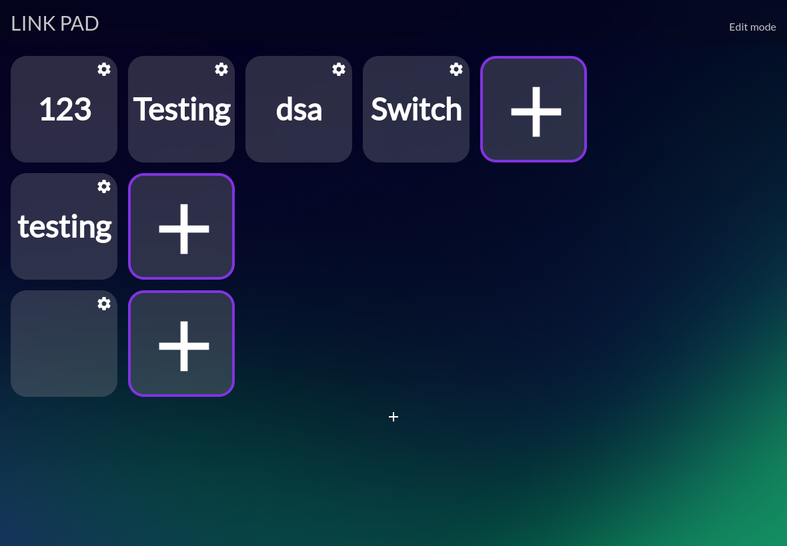

= Linkpad

Linkpad is a tool to create a gui for a bunch of "macros" you have defined / or from the presets .

It can be used to:

* Change scenes in obs
* Pause stream
* Run keybinds
* Close currently open application
* Take screenshots
* Send notifications
* Run API requests
* Open specific applications

All can be done via lua but we provide a bunch of templates that you can use if you dont want to program anything, you can use this application perfectly fine without knowing lua!

== TODO:

* Implement config options per module
* Implement a standard set of modules you can enable
* Ability to have pictures in modules work properly
* Add tray to tauri app and make it no longer just a backend
* Somehow make tauri open the site on the desktop and 0.0.0.0
* Make edit mode a actual option and possibly limit host access
* Probably many other things :-)

== Contributing:

All contributions are welcome feel free to implement new features and make a pull request or add some new documentation about something that might be unclear.
Pull requests fixing less than 5 typos will not accepted - If you want to fix typos find them all thanks!